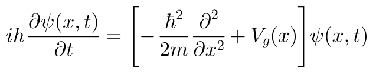
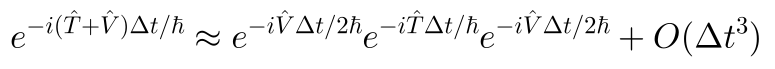
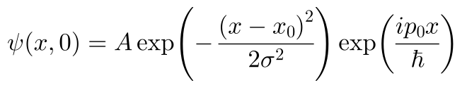

# SuperposedGravity_proj_1

# Numerical Time Evolution of Quantum States in Superposed Gravitational Fields


## Overview
This project implements a numerical solver for the time-dependent Schrödinger equation in one spatial dimension using a split-operator Fourier method.
The solver is applied to quantum systems evolving under gravitational potentials, with particular emphasis on branch-dependent gravitational fields versus an effective symmetric gravitational field.
The project is motivated by foundational questions in quantum mechanics and gravity, and focuses on clean numerical experimentation, stability, and physical interpretability.

## Scientific Motivation
In standard non-relativistic quantum mechanics, time evolution is defined with respect to a single global frame.
However, when gravitational fields are associated with superposed configurations, the consistency of quantum evolution becomes nontrivial.
This project explores, at a numerical level:
- how quantum states evolve under branch-dependent gravitational potentials
- how this evolution compares to an effective symmetric gravitational field
The goal is not to test a specific theory, but to provide a robust computational framework for comparing different gravitational scenarios.

## Physical Model
### Quantum System
- Single non-relativistic quantum particle
- One spatial dimension
- External gravitational potential
### Governing Equation
The time evolution is governed by the time-dependent Schrödinger equation:

where:
- $\hat{T} = -\frac{\hbar^2}{2m} \frac{d^2}{d x^2}$ is the kinetic operator
- $V_g(x)$ is the gravitational potential

### Gravitational Scenarios
#### Case A — Branch-dependent gravitational field
Two independent gravitational potentials are considered:
$V_g^{(1)}(x) = m g_1 x$ and $V_g^{(2)}(x) = m g_2 x$.
Each branch evolves under its own Hamiltonian.
#### Case B — Effective symmetric gravitational field
A single effective gravitational potential:
$V_g^{(eff)}(x) = m g_{eff} x$.
This provides a reference evolution with a common time parameter.


## Numerical Method
### Split-Operator Fourier Method
Time evolution over a small time step $\Delta t$ is approximated as:

Key features:
- Second-order accurate in time
- Unitary evolution
- Numerical stability
The methods exploits:
- position space for the potential operator
- momentum space for the kinetic operator
- **fast Fourier transforms** (FFT) to switch between representations

## Computational Implementation
### Spatial Discretization
- Domain: $x \in [-L/2,L/2]$
- Uniform grid with N points
- Periodic boundary conditions (FFT-consistent)

### Momentum Representation
Momentum space is defined via FFT frequencies: $p_k = \hbar k$.

### Time evolution Algorithm
For each time step:
1. Apply half-step potential evolution in position space
2. Transform to momentum space using FFT
3. Apply full-step kinetic evolution
4. Transform back to position space
5. Apply half-step potential evolution

All evolution operators are precomputed for efficiency.

## Results
### Initial state
The initial quantum state is chosen as a Gaussian wavepacket:

The wavefunction is explicitly normalized to ensure numerical consistency.

### Observables
During time evolution, the following quantities are computed:
- Expectation value of position $\langle x \rangle(t)$
- Expectation value of momentum $\langle p \rangle(t)$
- Norm conservation $|| \psi ||^2$
- Overlap between branch states: $O(t) = |\langle\psi_1(t)|\psi_2(t)\rangle|$

## Numerical Diagnostics
To validate the solver, the following checks are performed:
- Conservation of wavefunction norm
- Stability with respect to time-step size
- Qualitative consistency of expectation values

These diagnostics ensure the physical reliability of the numerical results.

## Project Structure
project_1/
│
├── src/
│        ├── solvers.py
│        ├── potentials.py
│        ├── initial_states.py
│        ├── observables.py
│        └── utils.py
│
├── scripts/
│        └── run_simulation.py
│
├── docs/
│         ├── initial_state.svg
│         ├── schrodinger_equation.svg
│         └── time_evolution.svg
│
├── results/
├── figures/
├── README.md
└── requirements.txt


---

### Minimal example (even simpler)
If you just want a quick tree:

````markdown
```text
src/
├── main.py
└── utils.py


## Technologies
- Python
- NumPy
- SciPy
- Matplotlib
- FFT-based numerical methods

## Keywords
Computational Physics, Numerical Simulation, Numerical Solvers, Quantum Systems, Gravitational Fields, Schrödinger Equation, Scientific Computing, Python

## Outlook
The current framework provides a clean baseline for:
- parameter sweeps
- systematic comparison of gravitational scenarios
- future integration of machine learning techniques for surrogate modeling and accelerated simulations (Scientific Machine Learning)